# COMP 264 - Cloud ML

Izzet Abidi (300898230) | Centennial College | AI - Software Engineering Technology | Winter 2025

---

This repository is the working portfolio for COMP 264. It starts with direct calls to managed AWS AI services, moves into SageMaker training and deployment, then broadens into workflow orchestration with Apache Airflow and AWS Step Functions. The common thread is learning how cloud ML work is assembled from storage, compute, managed services, automation, and cleanup discipline.

## Course Pipeline View

```mermaid
flowchart LR
    A["Assignment 1<br/>AWS service calls"] --> B["Lab 1<br/>SageMaker workflow"]
    B --> C["Assignment 2<br/>Train, deploy, evaluate"]
    C --> D["Lab 2<br/>Airflow orchestration"]
    D --> E["Lab 3<br/>Step Functions orchestration"]

    subgraph A1["Managed AI service integration"]
        A1S3["S3 storage"] --> A1NLP["Comprehend / Comprehend Medical"]
        A1NLP --> A1VISION["Rekognition OCR"]
        A1VISION --> A1TRANSLATE["Translate"]
        A1TRANSLATE --> A1SPEECH["Polly audio"]
        A1SPEECH --> A1API["Chalice API + frontend"]
    end

    subgraph ML["Custom ML lifecycle"]
        MLDATA["Clean Adult Income data"] --> MLENCODE["Encode features"]
        MLENCODE --> MLS3["Stage train / validation / test CSVs in S3"]
        MLS3 --> MLTRAIN["Train XGBoost in SageMaker"]
        MLTRAIN --> MLENDPOINT["Deploy endpoint"]
        MLENDPOINT --> MLMETRICS["Evaluate accuracy, ROC AUC, R2"]
        MLMETRICS --> MLCLEAN["Clean up endpoint and artifacts"]
    end

    subgraph ORCH["Workflow orchestration"]
        AIRFLOW["Airflow DAGs<br/>BashOperator, PythonOperator, XCom"] --> STEP["Step Functions<br/>states, inputs, IAM, service calls"]
        STEP --> LAMBDA["Lambda integration<br/>custom serverless task"]
    end

    A1API --> MLDATA
    MLCLEAN --> AIRFLOW
```



## Coursework Index

### Assignments

| # | Assignment | Main Files | AWS Services / Tools | Core Skill |
|---|------------|------------|----------------------|------------|
| 1 | [AWS Services Integration](Assignments/1/README.md) | [S3 upload script](Assignments/1/izzet_filesuplolad.py), [Comprehend CLI script](Assignments/1/assignment1_ex2_commands.sh), [Chalice API](Assignments/1/izzet_speaking_pictorial/app.py), [frontend](Assignments/1/izzet_speaking_pictorial/frontend/index.html), [architecture diagram](Assignments/1/diagrams/architecture.mmd) | S3, Comprehend, Comprehend Medical, Rekognition, Translate, Polly, Chalice | Programmatic interaction with managed cloud AI services |
| 2 | [SageMaker ML Training](Assignments/2/README.md) | [SageMaker notebook](Assignments/2/izzet_income.ipynb), [standalone script](Assignments/2/izzet_income_sagemaker.py), [screenshot checklist](Assignments/2/SCREENSHOT_CHECKLIST.md) | SageMaker, S3, XGBoost, pandas, scikit-learn | End-to-end model training, deployment, evaluation, and cleanup |

### In-Class Labs

| Lab | Topic | Main Files | Services / Tools | Core Skill |
|-----|-------|------------|------------------|------------|
| [Lab 1](Labs/LAB-1/README.md) | SageMaker XGBoost Pipeline | [notebook](Labs/LAB-1/In_Class_Lab_1_SageMaker_Adult_Income.ipynb), [workflow script](Labs/LAB-1/sagemaker_adult_income_lab.py), [screenshot checklist](Labs/LAB-1/SCREENSHOT_CHECKLIST.md) | SageMaker, S3, XGBoost, SHAP | Data preparation, training, deployment, evaluation, and evidence capture |
| [Lab 2](Labs/LAB-2/README.md) | Apache Airflow DAGs | [DAG 1](Labs/LAB-2/airflow_home/dags/my_izzet_dag1.py), [DAG 2](Labs/LAB-2/airflow_home/dags/my_izzet_dag2.py), [run helper](Labs/LAB-2/run_lab2.sh), [run order](Labs/LAB-2/docs/RUN_ORDER.md), [screenshot checklist](Labs/LAB-2/docs/SCREENSHOT_CHECKLIST.md) | Apache Airflow, BashOperator, PythonOperator, XCom | Local workflow orchestration, task dependencies, DAG testing, and reproducible lab execution |
| [Lab 3](Labs/LAB-3/README.md) | AWS Step Functions | [basics exercise](Labs/LAB-3/exercise-1-step-functions-basics/README.md), [Lambda integration exercise](Labs/LAB-3/exercise-2-step-functions-lambda/README.md), [Lambda handler](Labs/LAB-3/exercise-2-step-functions-lambda/lambda_function.py), [run order](Labs/LAB-3/docs/RUN_ORDER.md), [screenshot checklist](Labs/LAB-3/docs/SCREENSHOT_CHECKLIST.md) | Step Functions, Lambda, Comprehend, IAM | Serverless workflow design, state machine inputs, service integration, and AWS console execution evidence |

## Learning Narrative

The work so far forms a steady progression from individual AWS service calls toward complete cloud workflows.

**Assignment 1 establishes the service-integration foundation.** It begins with S3 and boto3, which introduces the basic mechanics of authenticating, calling AWS APIs, handling errors, and confirming results in cloud storage. The Comprehend exercise then shows that managed AI services are not just black boxes: the same text can produce different outputs from general NLP and medical PHI detection, so service choice matters. The Speaking Pictorial app ties those lessons together by chaining Rekognition, Translate, Polly, S3, and a Chalice API into one user-facing flow.

**Lab 1 and Assignment 2 shift from consuming AI APIs to training custom models.** The Adult Income workflow introduces the practical shape of SageMaker work: clean raw data, encode features, split datasets correctly, stage CSV files in S3, launch managed XGBoost training, deploy an endpoint, evaluate predictions, and delete resources afterward. Assignment 2 reinforces that model quality is only part of cloud ML engineering; repeatable setup, metric reporting, endpoint usage, and cost cleanup are all part of the job.

**Lab 2 adds orchestration discipline with Apache Airflow.** The first DAG focuses on scheduling structure, Bash tasks, templated commands, retries, and dependency graphs. The second DAG moves closer to an ETL pattern with extract, transform, and load tasks passing values through XCom. That makes the earlier SageMaker work easier to think about as a pipeline rather than a notebook-only sequence.

**Lab 3 moves orchestration into AWS-native serverless workflows.** Step Functions introduces explicit state-machine design, execution inputs, branching behavior, IAM permissions, and managed service calls. The Lambda integration exercise shows how custom compute can be inserted into a workflow when a managed service alone is not enough. Together, Labs 2 and 3 compare local workflow orchestration with cloud-native workflow orchestration.

By this point, the course work covers the main building blocks of cloud ML systems: storage in S3, SDK and CLI automation, managed AI services, model training and deployment, workflow orchestration, serverless functions, permissions, screenshots/evidence, and resource cleanup.

## Technology Stack

| Technology | Purpose | Used In |
|------------|---------|---------|
| boto3 | AWS SDK for Python | Assignment 1, SageMaker workflows |
| AWS CLI | Command-line access to AWS APIs | Assignment 1, labs |
| AWS Chalice | Serverless REST API framework | Assignment 1 |
| Amazon S3 | Object storage for files, datasets, audio, and model artifacts | Assignments 1-2, Lab 1 |
| Amazon Comprehend | NLP entity extraction and sentiment analysis | Assignment 1, Lab 3 |
| Amazon Comprehend Medical | PHI detection | Assignment 1 |
| Amazon Rekognition | Image text detection | Assignment 1 |
| Amazon Translate | Neural machine translation | Assignment 1 |
| Amazon Polly | Text-to-speech synthesis | Assignment 1 |
| Amazon SageMaker | Managed ML training and deployment | Assignment 2, Lab 1 |
| AWS Lambda | Serverless custom compute | Lab 3 |
| AWS Step Functions | Managed serverless workflow orchestration | Lab 3 |
| Apache Airflow | Local workflow orchestration and DAG execution | Lab 2 |
| XGBoost | Gradient boosting model for tabular classification | Assignment 2, Lab 1 |
| pandas | Data loading, cleaning, and feature preparation | Assignment 2, Lab 1 |
| scikit-learn | Splitting and evaluation metrics | Assignment 2, Lab 1 |
| SHAP | Model explainability | Lab 1 |

## Running the Repository

### Assignment 1

```bash
# Exercise 1: S3 file upload
cd Assignments/1
python3 izzet_filesuplolad.py --bucket <your-bucket>

# Exercise 2: Entity extraction
./assignment1_ex2_commands.sh "Your text here"

# Exercise 3: Speaking Pictorial
cd izzet_speaking_pictorial
chalice local
# Open frontend/index.html in a browser
```

### Assignment 2

```bash
# Option A: run on a SageMaker notebook instance
# Upload izzet_income.ipynb, adult.data, and adult.test to SageMaker
# Run all cells with the conda_python3 kernel

# Option B: local preprocessing only
cd Assignments/2
python3 izzet_income_sagemaker.py
```

### In-Class Lab 1

```bash
cd Labs/LAB-1
python3 sagemaker_adult_income_lab.py
# Set RUN_SAGEMAKER_PIPELINE=true for the full AWS pipeline
```

### In-Class Lab 2

```bash
cd Labs/LAB-2
./run_lab2.sh init
./run_lab2.sh list
./run_lab2.sh test 2026-03-20
./run_lab2.sh start
# Open http://localhost:8080, then run ./run_lab2.sh stop when finished
```

### In-Class Lab 3

```bash
cd Labs/LAB-3
# Follow docs/RUN_ORDER.md while using the JSON inputs and snippets in each exercise folder.
```

## Industry Context

The coursework maps to practical cloud ML engineering patterns:

- **Managed AI service integration** mirrors product features such as OCR, translation, speech output, entity extraction, and PHI detection.
- **SageMaker training and deployment** follows the normal model lifecycle for tabular ML: preprocessing, S3 staging, managed training, endpoint inference, metrics, and cleanup.
- **Airflow DAGs** represent repeatable data and ML workflows where each step can be retried, tested, logged, and scheduled.
- **Step Functions and Lambda** show how production teams coordinate serverless tasks, AWS service calls, permissions, and execution evidence without managing servers.
- **Cost control and cleanup** appear throughout the repository because cloud ML work is incomplete until endpoints, notebooks, state machines, roles, and stored artifacts are accounted for.
